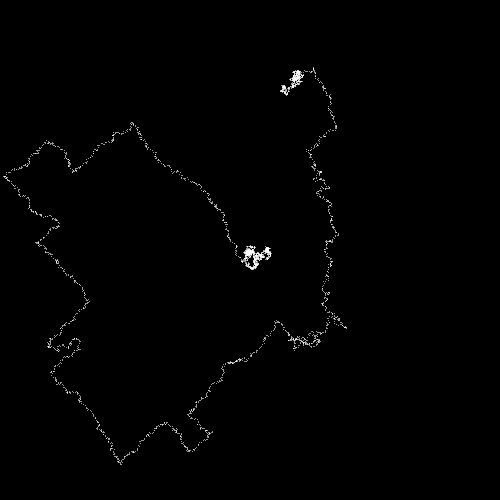

# Intro - Exercise I.3

> Create a random walker with dynamic probabilities. For example, can you give it a 50% chance of moving in the direction of the mouse?

In this sketch the walker avoids the mouse. If it is too close it will dramatically increase the chance of going in the opposite direction.

[Link](http://natureofcode.com/book/introduction/#intro_exercise3)

