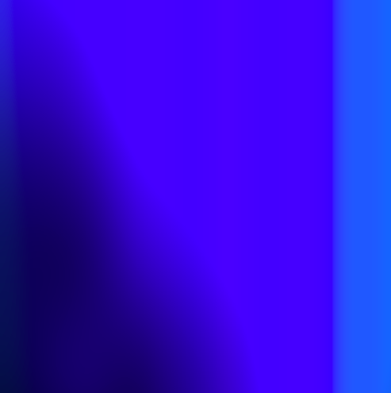
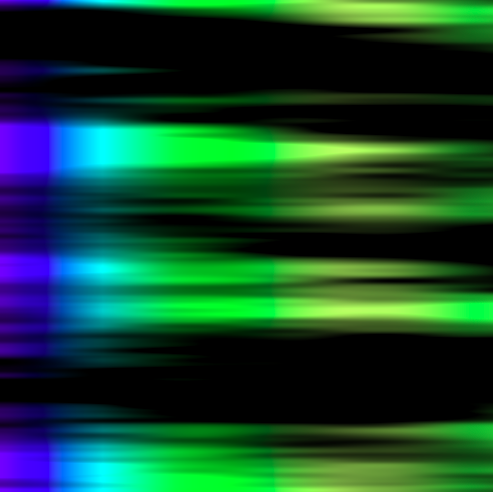

# Intro - Exercise I.8

> Play with color, noiseDetail(), and the rate at which xoff and yoff are incremented to achieve different visual effects.

[Link](http://natureofcode.com/book/introduction/#intro_exercise8)

